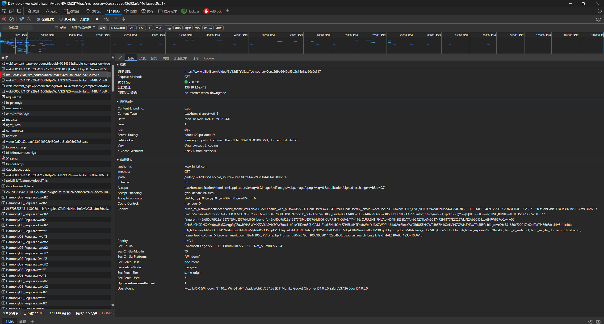
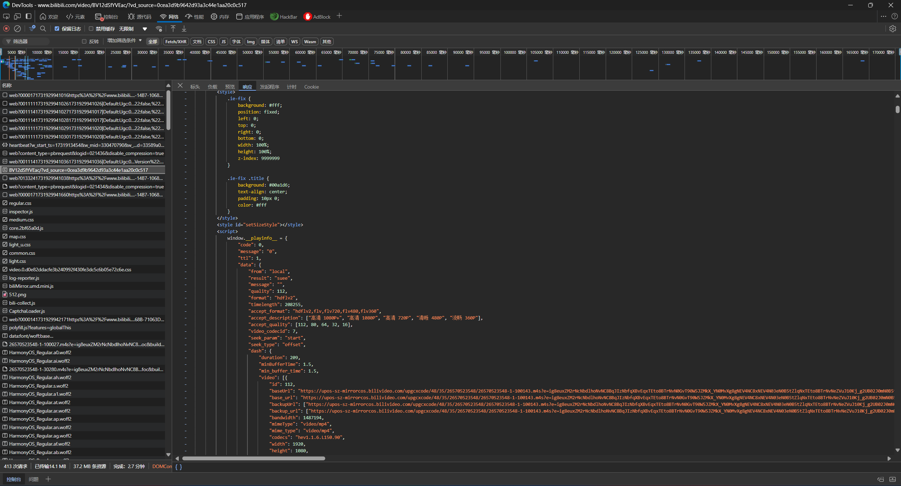
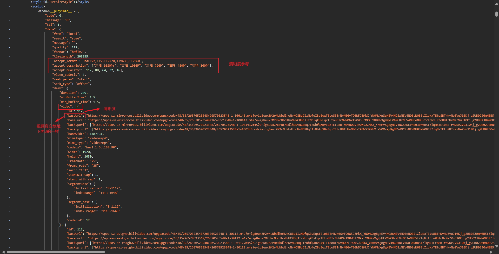
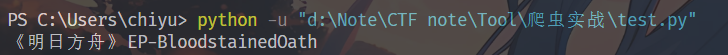
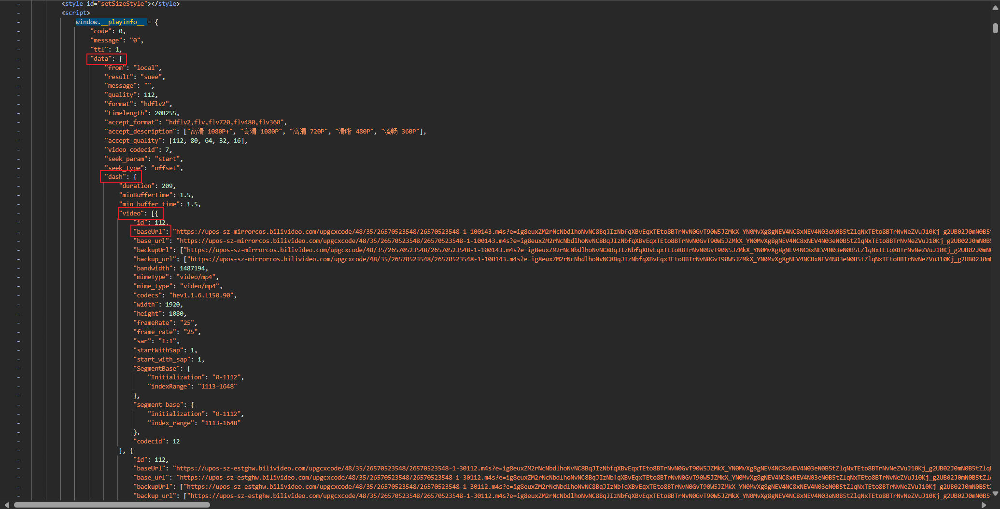
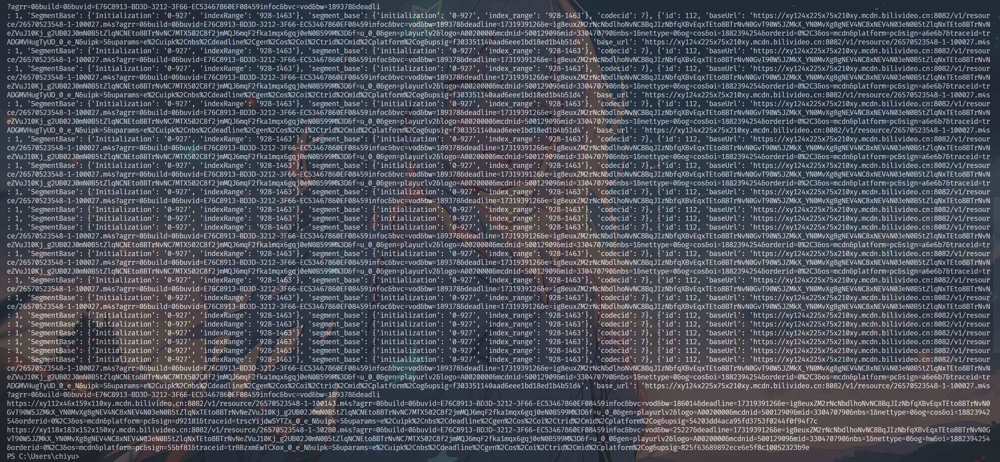

# bilibili-crawler

## 介绍
这是一个基于Python的Bilibili视频爬虫，仅可以爬取Bilibili的视频，其他内容等待后续学习

## 参考文档
[requests文档](https://requests.readthedocs.io/en/latest/)

## 环境
edge浏览器，python3

## 开始
1. 安装requests库
```bash
pip install requests
```
2. 导入requests库
```python
import requests
```
以https://www.bilibili.com/video/BV12dSfYVEac为例

1. F12查看网页源码，来到网络窗口，找到视频对应的bv号，查看响应


可以看到在`window.__playinfo__ `模块有视频的真实地址，当直接将其复制到浏览器地址栏访问时，可以下载这个文件，但是无法访问，所以需要利用cookie来发送get请求获取文件，并且要使用referer来过滤防盗链。

```python
url = 'https://www.bilibili.com/video/BV12dSfYVEac/' #BV号后面一定要加个/，还不知道怎么回事
cookie = 'your cookie' #你的cookie
headers = {
    'cookie': cookie,
    'referer': 'https://www.bilibili.com/', #referer一定要加上，不然会被过滤
    "User-Agent":"Mozilla/5.0 (Windows NT 10.0; Win64; x64) AppleWebKit/537.36 (KHTML, like Gecko) Chrome/131.0.0.0 Safari/537.36 Edg/131.0.0.0", #换成你自己的浏览器UA
}
res = requests.get(url, headers=headers) #发送get请求
html = res.text #获取响应内容
```

2. 阅读响应内容，可以看到有视频的真实地址，以及各清晰度对应的代号，我们可以根据需要下载不同的清晰度，在这里我下载最高清晰度

在此之前，我们要实现自动化，避免每次新的网址都要重新更改视频源地址，我们可以对响应内容进行过滤，自动选择出需要的视频地址
```python
import re
title = re.findall('title="(.*?)"', html)[0] #获取第一个找到的视频标题
title = title.replace(' ','') #由于b站视频音频分开的，后续需要ffmpeg进行合并，所以提前去掉掉空格
print(title) #打印出视频标题
```

可以看到成功了

3. 接着我们需要对`window.__playinfo__ `里的内容进行过滤
```python
info = re.findall('window.__playinfo__=(.*?)</script>', html)[0] #获取第一个找到的window.__playinfo__内容
json_data = json.loads(info) #将json字符串转化为字典
print(json_data) #打印出json字典
video_url = json_data['data']['dash']['video'][0]['baseUrl'] #获取视频地址
audio_url = json_data['data']['dash']['audio'][0]['baseUrl']
print(video_url)
print(audio_url)
```
这里的data，dash，video，baseUrl都是固定的，依次是`window.__playinfo__ `内容的逐级展开


可以看到获取url成功了，接下来我们需要下载视频和音频

4. 下载视频和音频
```python
video_res = requests.get(video_url, headers=headers) #发送get请求,获取视频内容
audio_res = requests.get(audio_url, headers=headers)
with open(title+'_.mp4', 'wb') as f: #以二进制写入视频文件,加_的原因是为了后续合并操作方便
    f.write(video_res.content)
with open(title+'_.mp3', 'wb') as f:
    f.write(audio_res.content)
```
这样就能下载到最高清晰度的视频和音频了，并且可以直接观看

5. 合并视频和音频
```python
def craft(title,name):
    cmd = fr"ffmpeg -i {title}.mp4 -i {title}.mp3 -c copy -map 0:v:0 -map 1:a:0 {name}.mp4" #合并命令
    os.system(cmd)
    os.remove(f"{title}.mp4")
    os.remove(f"{title}.mp3")
craft(title+'_',title)
```
至此结束

## 总结
作为第一次实战爬虫，这次的项目还是比较简单的，主要是熟悉了requests库的使用，以及json数据的解析，还有ffmpeg的使用，还有一些细节的处理，比如文件的写入等等
一开始学习时我阅读别人的代码，看着长篇大论头疼不已，但实际上上手才能体会到精髓，当仔细去写每个功能时，才能体会到实际并不复杂


